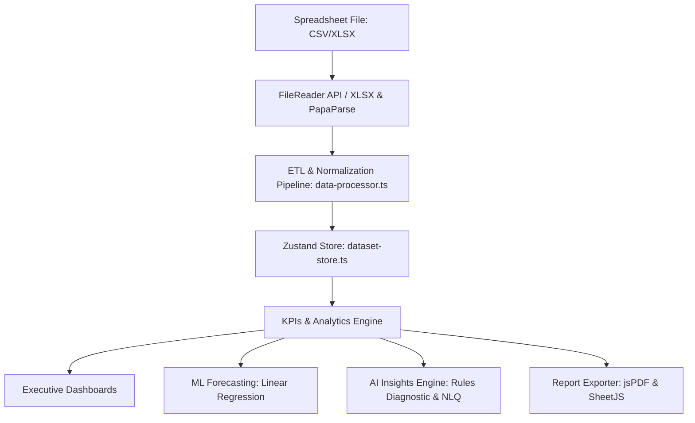

# SalesPulse AI — Comprehensive Project Handover Document

This document serves as a complete technical reference and handover manual for the **SalesPulse AI** project. It details the system architecture, file directory arrangements, detailed functionality of each module, coding patterns, performance optimizations, and future roadmap.

---

## 1. Project Overview & Architecture
SalesPulse AI is a high-performance, browser-based Business Intelligence (BI) and analytics platform. The application is built on a **fully client-side data processing model**. This design means all data cleaning, data profiling, KPI computations, segmentation, ML forecasting, and AI insight generations are performed directly in the user's browser, ensuring **100% data privacy and security** with zero backend database dependencies for data storage.



### Core Architecture Components
1. **Frontend View Layer**: Next.js 16 (React) + TypeScript structured under the `/src/app` App Router.
2. **State Management**: Zustand stores under `/src/store` managing active datasets, user authentication, AI chat states, and generated report list.
3. **Data Imputation & Processing Core**: Custom business-logic processing libraries under `/src/lib` using PapaParse (for CSV) and SheetJS (for Excel).
4. **Visualization Layer**: Apache ECharts wrapper components dynamically rendered via React Suspense inside HTML5 Canvas wrappers.
5. **Styling & Theme Engine**: Vanilla CSS design system matching strict premium design guidelines (dark mode, glassmorphism card interfaces, smooth transitions).

---

## 2. Directory Structure & File Mapping
Below is the complete project directory structure representing all files and subdirectories.

```
salespulse-ai/
├─ .github/                     # CI/CD pipelines
├─ backend/                     # Optional Python backend API
├─ frontend/                    # Core React application
│  ├─ public/                   # Static assets & public resources
│  │  ├─ assets/                # Core brand images
│  │  └─ data/                  # Mock and sample database files
│  │     └─ sample_sales.json   # 350-row enterprise sales dataset
│  ├─ scripts/                  # Command-line helper scripts
│  │  └─ generate-sample-data.js# Mathematical generator for mock sales
│  ├─ src/
│  │  ├─ app/                   # App Router directories
│  │  │  ├─ (auth)/              # Auth routes group (Login, Forgot Password, Register)
│  │  │  ├─ (dashboard)/         # Actual dashboard implementations
│  │  │  │  ├─ analytics/       # BI Dashboards (KPIs, Sales, Products, Customers, Profit)
│  │  │  │  ├─ forecasting/     # ML Forecasting UI
│  │  │  │  ├─ insights/        # AI SWOT and Narrative reports
│  │  │  │  ├─ inventory/       # ABC Inventory and suppliers dashboard
│  │  │  │  ├─ reports/         # PDF/Excel Export & schedules UI
│  │  │  │  ├─ settings/        # App preferences & profile configurations
│  │  │  │  ├─ upload/          # CSV/Excel drop zone & ETL audit preview
│  │  │  │  └─ page.tsx         # Dashboard landing page component
│  │  │  ├─ dashboard/          # Alias routes wrapper pointing to (dashboard) components
│  │  │  ├─ globals.css          # Design system variables, glassmorphism, animations
│  │  │  ├─ layout.tsx          # Root HTML layout and fonts loading
│  │  │  ├─ page.tsx            # Corporate landing marketing page
│  │  │  └─ providers.tsx       # Zustand, React Query & Theme providers wrapper
│  │  ├─ components/            # UI components
│  │  │  ├─ charts/              # ECharts wrappers and chart helpers
│  │  │  └─ layout/              # Nav sidebar, topbar, notification panels
│  │  ├─ lib/                   # Business logic helpers
│  │  │  ├─ ai-insights.ts      # Rule-based diagnostic report and SWOT generator
│  │  │  ├─ chart-utils.ts      # ECharts options builders
│  │  │  └─ data-processor.ts   # Core ETL, cleaning, calculations & ML forecasting
│  │  ├─ store/                 # Zustand state managers
│  │  │  ├─ ai-store.ts         # NLQ chat history & cards
│  │  │  ├─ auth-store.ts       # Mock login authentication
│  │  │  ├─ dataset-store.ts    # Central database store containing calculations
│  │  │  └─ report-store.ts     # Document outputs and scheduling hooks
│  │  ├─ types/                 # Unified TypeScript interfaces
│  │  └─ middleware.ts          # Authentication routes guard
│  ├─ next.config.js            # Custom turbopack, compression & stripping configs
│  ├─ package.json              # Frontend manifest & dependencies
│  └─ tsconfig.json             # TypeScript rules configuration
├─ package.json                 # Monorepo workspaces manifest
└─ HANDOVER.md                  # Handover Documentation (This file)
```

---

## 3. Deep-Dive: Detailed Module Functionality

### 1. ETL File Loader & Data Normalizer (`upload` & `data-processor.ts`)
* **File Parser**: Uses `FileReader` combined with `PapaParse` (for CSV files) or `XLSX` (for binary Excel files) to load spreadsheets directly into JSON arrays in memory.
* **Fuzzy Schema Mapper**: Scans file headers using a list of column aliases defined in `COLUMN_ALIASES`. For instance, a column named "Net Revenue", "selling price", or "total amount" will automatically map to the unified `selling_price` state.
* **Auto Cleaning Pipeline**:
  * Removes fully blank or duplicate rows (tracked via unique `sales_id`).
  * Normalizes numbers (strips currency symbols `$,₹,€`, scales discounts if entered as integers e.g., `10 -> 0.1`).
  * Imputes missing numeric values (derives `selling_price = unit_price * qty * (1 - discount)` or maps `cost_price = selling_price * 0.6` as a standard fallback margin).
  * Cleans categoricals (defaults missing states or salesperson fields to `"Unknown"`, maps dates to safe JS `Date` objects).
* **Audit Reporter**: Computes a numerical **Data Quality Score** out of 100 based on missing headers, duplicate fields, extreme outlier counts, and removed invalid rows. Displays an interactive **ETL Audit Report** containing stats on rows cleaned, outliers flagged, and datatypes fixed.

### 2. Executive KPIs Engine (`analytics` & `data-processor.ts`)
* **Metric Compiler**: Computes high-level aggregated operational statistics:
  * **Total Revenue**: Sum of net sales.
  * **Gross Profit**: Sum of sales revenue minus total product cost price times quantities.
  * **Operating Margin**: `(Profit / Revenue) * 100`.
  * **Loss-making Orders Ratio**: Percentage of orders where total cost price exceeded net selling price.
  * **Growth Indices**: Chronologically sorts transactions, cuts the dataset in half, and calculates percentage differences between period 1 and period 2 to display dynamic positive/negative trend values.

### 3. Sales & Geographic Trends (`analytics/sales`)
* **Timeframe Aggregations**: Groups and sorts cleaned data into daily timeline intervals, ISO weekly buckets, monthly periods, quarterly increments, or annual developments.
* **Moving Averages**: Calculates 7-day and 30-day moving average curves to smooth out business volatility and show real growth trajectories.
* **Geographical Drill-Down**: Aggregates sales volume, order frequency, and revenue distribution grouped by region, state, and city.
* **Salesperson Performance**: Profiles salesperson deals to extract average deal values, volume generated, and total sales leaderboards.
* **Payment & Fulfillment Audits**: Breaks down distributions by payment types and order fulfillment statuses.

### 4. Product Analytics & Inventory Turnovers (`analytics/product` & `inventory`)
* **Top & Underperforming SKUs**: Ranks products by total volume sold, revenue, net profit margin contribution, and category distributions.
* **ABC Inventory Analysis**: Applies standard Pareto principle:
  * **Class A**: Top 20% of products driving 80% of total revenue (critical focus items).
  * **Class B**: Next 30% of products driving 15% of revenue.
  * **Class C**: Bottom 50% of products driving remaining 5% of revenue.
* **Dead Stock Detector**: Flags inventory SKUs that have high current stock values in storage but show no sales records over the past 60 days.
* **Inventory Turnover Calculations**: Computes item turnover ratios: `Quantity / (Current Stock + Quantity / 2)`.
* **Supplier Performance Scorecard**: Groups stock records by supplier, calculating average turnovers, total storage volume, and stock counts.

### 5. Customer Lifecycle & RFM Segmentation (`analytics/customer`)
* **Loyalty Profiling**: Tracks returning customer ratios, average lifetime values (CLV), and monthly retention dynamics.
* **Churn Diagnostic**: Identifies inactive customers (no purchases within 90 days) and estimates overall churn rates.
* **RFM Scoring & Segmentation Matrix**: Computes Recency, Frequency, and Monetary values:
  * **Recency (R)**: Days since last order.
  * **Frequency (F)**: Total orders placed.
  * **Monetary (M)**: Total lifetime purchase values.
  * Assigns weightings to translate numeric values into segments: *Champions, Loyal Customers, At Risk, and Lost*.
* **Demographics Map**: Visualizes revenue contribution curves grouped by custom customer age brackets (18-25, 26-35, etc.) and genders.

### 6. Predictive Machine Learning Forecasting (`forecasting`)
* **Model Math**: Uses a client-side multivariate linear regression line solver to fit the historical timeline sales data points.
* **Predictive Future Run-Rate**: Extends the line slope to forecast future monthly and quarterly sales volumes.
* **Confidence Intervals**: Computes standard errors and standard deviations of residuals to generate upper and lower 95% confidence bands around the predicted run-rate, indicating forecast margins of error.

### 7. Built-in Rule-Based AI Insights Engine (`lib/ai-insights.ts`)
* **Executive Narratives**: Dynamically reads computed KPI values to compile a paragraph summarizing overall financial health, growth indices, and category strengths.
* **SWOT Generator**: Processes metrics to generate an interactive quadrant analysis (*Strengths, Weaknesses, Opportunities, Threats*). For instance, if the loss ratio exceeds 5%, it dynamically appends a Weakness card.
* **Actionable Recommendations**: Produces prioritized (*Critical, High, Medium, Low*) lists of business recommendations with expected impacts and specific actions (e.g., target reorder alerts, campaign launches).
* **NLQ (Natural Language Query) Engine**: A local conversational handler that matches user inquiries to specific analytical queries (e.g., "Why is profit low?", "What are my top products?"), returning markdown tables and bullet summaries instantly.

### 8. PDF/Excel Report Exporter (`reports` & `store/report-store.ts`)
* **PDF Exporter**: Uses `jspdf` and `jspdf-autotable` to format, construct, and export professional document layouts client-side. Contains tables of executive KPIs, ABC analysis, and regional revenue breakdowns.
* **Spreadsheet Export**: Uses `xlsx` (SheetJS) to convert multi-dimensional calculated stores into organized multi-tab workbook files (Sales Sheet, Product Sheet, Inventory Sheet) for offline spreadsheets.
* **Schedules Manager**: Permits simulating, listing, and setting up automated weekly/daily report compilation schedules with mock recipient lists.

---

## 4. Local Run & Deployment Instructions

### Local Run Commands
This project is configured with npm workspaces. You can run all development, building, and typechecking workflows from the repository root:

1. **Install all workspace dependencies**:
   ```bash
   npm install
   ```
2. **Start the development server**:
   ```bash
   npm run dev
   ```
   The app will run locally at `http://localhost:3000`.
3. **Build the production build locally**:
   ```bash
   npm run build
   ```
4. **Run TypeScript compiler strict checks**:
   ```bash
   npm run typecheck
   ```
5. **Run Linting**:
   ```bash
   npm run lint
   ```

### Production Deployment
Since the application compiles to a static Next.js build (`output: 'standalone'` or fully static output), it can be deployed to any static site host like **Vercel, Netlify, AWS Amplify, or Azure Static Web Apps**:
* **Build Command**: `npm run build`
* **Output Folder**: `frontend/.next` or `frontend/out`
* **Environment Variables**: Configure `NEXT_PUBLIC_API_URL` to point to your backend API server (if connecting the optional Python backend).

---

## 5. Completed Code Optimizations

The following performance systems are fully integrated into the code:
1. **Dynamic Chart Bundling**: Changed all 7 analytical dashboards to import ECharts wrapper elements dynamically:
   ```typescript
   import dynamic from "next/dynamic";
   const EChartsWrapper = dynamic(() => import("@/components/charts/echarts-wrapper"), {
     ssr: false,
     loading: () => <div className="animate-pulse bg-muted/25 rounded-xl h-[280px] w-full" />
   });
   ```
   This trims over 500kb of heavy canvas library code from the main initial page load bundle, enabling near-instantaneous landing page interactions and rendering a smooth shimmer placeholder during load.
2. **Turbopack & SWC Compilations**: Enabled Next.js Turbo settings for fast hot-module reloads (HMR).
3. **Gzip Asset Compression**: Enabled production gzip compression (`compress: true`) in `next.config.js`.
4. **Log Stripping**: Enabled production removeConsole rules in `next.config.js` to strip debug comments and logs from the deployed runtime.

---
*Generated by SalesPulse AI Core Assistant on 2026-07-11.*
